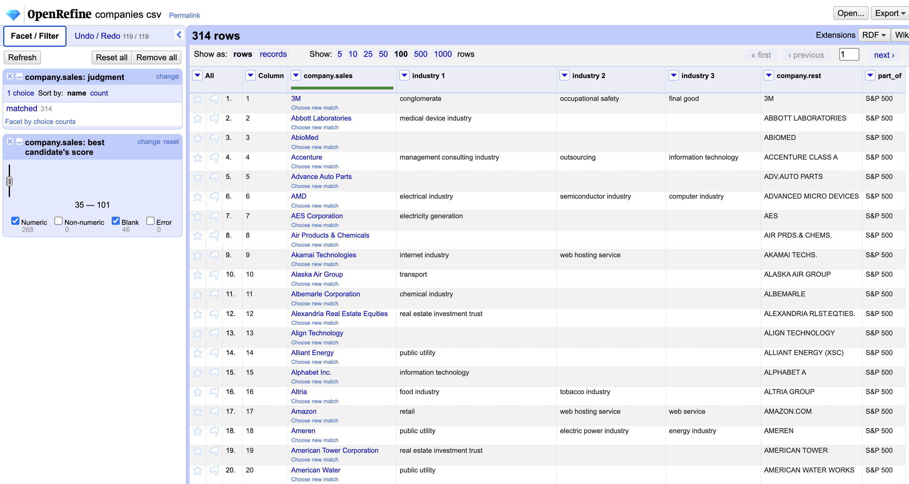

# 3. Data Preparation

The second stage of CRISP-DM within this project is data preparation. Within this section, we will transform the data according to the requirements we gained in the data understanding stage. For the sales data, the goals are to apply a log transformation to symmetrize the distribution of our target variable, to remove duplicated data points, to exclude companies with less than 40 observations, to interpolate the time series' of companies that have gaps or missing data and to finally split the target variable into one variable for each quarter, which will make following steps easier.\
For the balance sheet and for the profit and loss data, the goals are to case fold and replace variable names to achieve a unified notation of the variables, to remove variables where more than 20% of the data is missing, to log transform right-skewed variables and to impute missing values of variables by applying spline interpolation. After that, we will join the three data sets into one combined table. As the naming schemes for the company names are different for the sales and other two tables, we will perform a fuzzy join method, that employs a string distance measure on the join attribute. After we joined the tables together, we will again perform a correlation analysis. Since strong correlations between variables can lead to instabilities when modeling the data, we will reduce the correlation with two approaches: (1) we will only select variables that are not highly correlated, and (2) we perform a principal component analysis to reduce the dimensionality of the data. The companies that are remaining after the aforementioned preparation steps will be enriched by their respective industries/business sectors from WikiData. This step will be performed in OpenRefine outside this notebook. Finally a train test split will be carried out. We will use the last five years of each company time series as test fold and the years before the testing period as the training fold.

## Imports

```{r}
if(!require(corrplot)) {
  install.packages("corrplot")
}
library(corrplot)

if (!require(tidyverse)) {
  install.packages("tidyverse")
}
library(tidyverse)

if (!require(zoo)) {
  install.packages("zoo")
}
library(zoo)

if (!require(lares)) {
  # install lares correlation package from github
  devtools::install_github("laresbernardo/lares")
}
library(lares)

if (!require(imputeTS)) {
  install.packages("imputeTS")
}
library(imputeTS)

if (!require(lubridate)) {
  install.packages("lubridate")
}
library(lubridate)

if (!require(caret)) {
  install.packages("caret")
}
library(caret)

if (!require(fuzzyjoin)) {
  install.packages("fuzzyjoin")
}
library(fuzzyjoin)

if (!require(dplyr)) {
  install.packages("dplyr")
}
library(dplyr)
```

## Constants

```{r}
Sys.unsetenv("LARES_FONT")
BASE_PATH <- "../data/processed"
SALES_PATH <- paste(BASE_PATH, "sales.csv", sep = "/")
BALANCE_SHEET_PATH <- paste(BASE_PATH, "balance_sheet.csv", sep = "/")
PROFIT_LOSS_PATH <- paste(BASE_PATH, "profit_loss.csv", sep = "/")
COMPANY_OUTPUT_PATH <- paste(BASE_PATH, "companies.csv", sep = "/")
DATA_JOINED_OUTPUT_PATH <- paste(BASE_PATH, "data_joined.csv", sep = "/")
TRAIN_VAR_SEL_OUTPUT_PATH <- paste(BASE_PATH, "train_var_sel.csv", sep = "/")
TEST_VAR_SEL_OUTPUT_PATH <- paste(BASE_PATH, "test_var_sel.csv", sep = "/")
TRAIN_PCA_OUTPUT_PATH <- paste(BASE_PATH, "train_pca.csv", sep = "/")
TEST_PCA_OUTPUT_PATH <- paste(BASE_PATH, "test_pca.csv", sep = "/")
```

## 3.1. Sales
### 3.1.1 Load data

```{r}
df_sales <- read_csv(SALES_PATH, show_col_types = FALSE)
df_sales <- df_sales[, -1] # remove index column
head(df_sales)
```

### 3.1.2 Log transform interim_sales variable
To make the target variable interim_sales more symmetrical, we will use a log transformation. As the variable also contains negative values which cannot be log-transformed, we will add a constant to the variable to make all values positive. After modeling, we then just have to apply an exponential function and subtract the constant again to invert the transformation.

```{r}
par(mfrow = c(2, 1))
hist(df_sales$interim_sales)

log_transform_with_constant <- function(series) {
  series_min <- min(na.omit(series)) # na.omit to exclude Nan from minimum
  
  if (series_min <= 0) {
    constant <- 1 + series_min * -1
  } else {
    constant <- 0
  }
  series_transformed <- log(series + constant)
  return(list("series_transformed" = series_transformed, "constant" = constant))
}

res.interim_sales_log <-
  log_transform_with_constant(df_sales$interim_sales)
INTERIM_SALES_LOG_CONSTANT <- res.interim_sales_log$constant
hist(res.interim_sales_log$series_transformed)
df_sales$log.interim_sales <- res.interim_sales_log$series_transformed  
cat(paste("Used constant for log transformation:", res.interim_sales_log$constant))
```

In the histogram of the log transformed interim sales variable, we can see that there are outlier points, i.e. points with a log transformed value of \< 12. Such values will be challenging for our forecasting algorithms, let's now investigate for which data points this happens.

```{r}
df_sales[df_sales$log.interim_sales < 12,]
```

We can see, that there is only one data point, that is an outlier point. We can see that this observation occurred in the third quarter in 2008 and we can expect that this an outcome of the financial crisis. We will exclude this point and later on create a new value in the interpolation step.

```{r}
df_sales <- df_sales[!df_sales$log.interim_sales < 12,]
hist(df_sales$log.interim_sales)
```

As we can see now, the distribution looks much cleaner with this point removed. In the next step, we will remove duplicated data points from the dataset.

### 3.1.3 Remove duplicated data points

```{r}
# perform duplicate elimation
cat(paste("Number of data points before deduplication step:", nrow(df_sales)), "\n")
df_sales_no_dup <- distinct(df_sales, .keep_all = TRUE)
cat(paste("Number of data points after deduplication step:", nrow(df_sales_no_dup)), "\n")
cat(paste(nrow(df_sales) - nrow(df_sales_no_dup)), " data points were removed.", "\n")
```

We can observe that 146 duplicated data points were removed from the data set. We will now exclude companies with less than 40 observations (5 years training, 5 years testing for 4 quarters per year).

### 3.1.4 Exclude companies with less than 40 observations

```{r}
companies_before <- n_distinct(df_sales_no_dup$company)

# calculate observations per company
obs_per_company <-
  df_sales_no_dup %>% 
  group_by(df_sales_no_dup$company) %>% 
  summarise(n_observations = n()) %>% 
  arrange(n_observations)

# rename column 
colnames(obs_per_company)[1] <- "company"

n_min <- 40 # at least 5 years for training and 5 years for evaluation * 4 = 40 

companies_to_exclude <- obs_per_company[obs_per_company$n_observations < n_min, ]$company

df_sales_no_dup <- df_sales_no_dup[!(df_sales_no_dup$company %in% companies_to_exclude),]

companies_after <- n_distinct(df_sales_no_dup$company)
cat(paste(companies_before - companies_after, 
          "companies were removed because of having less than", n_min, "observations\n"))
```

### 3.1.5 Interpolate companies with non-continous time series'

```{r}
# create date from year and quarter
df_sales_no_dup$date <-
  as.Date(as.yearqtr(paste0(df_sales_no_dup$year, "-", 
                            df_sales_no_dup$quarter), format = "%Y-%q"))


check_continuity <- function(df, obs_per_company){
    # create new column that marks if ts is continuous,
    # set to true for all companies in the beginning
    obs_per_company$is_continous <- TRUE

    for (company in unique(df$company)) {
    # for each company
    company_dates <- df[df$company == company,]$date
    company_dates <- sort(company_dates) # select sorted dates
    for (i in 1:(length(company_dates) - 1)) {
      # for each date index
      difference_in_days <-
        as.integer(company_dates[i + 1] - company_dates[i])
      # in case there are two months with 31 days in the quarter,
      # the maximum valid difference in days is 92
      if (difference_in_days > 92) {
        obs_per_company[obs_per_company$company == company, "is_continous"] <-
          FALSE
        break
      }
    }
  }
  
  cat("Found",
      paste(nrow(obs_per_company[obs_per_company$is_continous == FALSE, ])),
      "companies that do not have a continous sales time series.")
  return(obs_per_company)
} 
obs_per_company <- check_continuity(df_sales_no_dup, obs_per_company)


```

```{r}
# complete time series (i.e., create equidistant points) and interpolate missing values
df_sales_no_dup_intepol <- 
  df_sales_no_dup %>%
  mutate(date =  as.Date(as.yearqtr(paste0(df_sales_no_dup$year, "-", 
                                           df_sales_no_dup$quarter), 
                                    format = "%Y-%q"))) %>%
  group_by(company) %>%
  complete(date = seq.Date(min(date), max(date), by="quarter")) %>% 
  mutate(log.interim_sales = na_interpolation(log.interim_sales, 
                                              option = "spline")) %>% 
  ungroup()

# check continuity again
obs_per_company <- check_continuity(df_sales_no_dup_intepol, obs_per_company)
```

```{r}
# the completion of the time series created missing values for some years and quarters, 
# we will now employ the created date column to parse years and quarters. 
df_sales_no_dup_intepol$quarter <- quarter(df_sales_no_dup_intepol$date)
df_sales_no_dup_intepol$year <- year(df_sales_no_dup_intepol$date)

# remove original interim sales
df_sales_no_dup_intepol <- subset(df_sales_no_dup_intepol, 
                                  select=-c(interim_sales))

# check if previous steps were successful
colSums(is.na.data.frame(df_sales_no_dup_intepol))
head(df_sales_no_dup_intepol)

```

### 3.1.6 Create a seperate column for the sales variable in each quarter

```{r}
# we have to create a separate column for each quarter to later join on the year variable
df_sales_final <- df_sales_no_dup_intepol %>%
  select(-date) %>%
  pivot_wider(names_from = quarter,
              names_prefix = "log.interim_sales_Q",
              values_from = log.interim_sales) %>%
  select( # reorder columns
    company,
    year,
    log.interim_sales_Q1,
    log.interim_sales_Q2,
    log.interim_sales_Q3,
    log.interim_sales_Q4
  )

df_sales_final
```

## 3.2. Balance sheet
### 3.2.1 Load data

```{r}
df_balance_sheet <- read_csv(BALANCE_SHEET_PATH, show_col_types = FALSE)
df_balance_sheet <- df_balance_sheet[, -1]
head(df_balance_sheet)
```

### 3.2.2 Casefold variable names and replace whitespaces

```{r}
transform_column_names <- function(colnames_df) {
  colnames_df_new <- c()
  for (i in 1:length(colnames_df)) {
    tmp <- casefold(colnames_df[i]) # lowercase
    tmp <- str_replace_all(tmp, " ", "_") # replace white spaces by underscore
    tmp <- str_replace_all(tmp, "\\.", "") # remove dot
    tmp <- str_replace_all(tmp, "\\,", "") # remove comma
    tmp <- str_replace_all(tmp, "\\(", "") # remove (
    tmp <- str_replace_all(tmp, "\\)", "") # remove )
    tmp <- str_replace_all(tmp, "\\/", "") # remove /
    tmp <- str_replace_all(tmp, "\\-", "") # remove -
    tmp <- str_replace_all(tmp, "\\&", "and") # replace & by and
    tmp <- str_replace_all(tmp, "\\<", "lt") # replace < by lt
    colnames_df_new[i] <- tmp
  }
  return(colnames_df_new)
}
colnames(df_balance_sheet) <- transform_column_names(colnames(df_balance_sheet))
colnames(df_balance_sheet)

```

### 3.2.3 Remove variables where \> 20% of values are missing

In the data understanding notebook, we saw that there are some variables where \> 20% of the values are missing. We will remove those variables, as imputation will potentially introduce too much noise into the data.

```{r}
df_balance_sheet <- subset(df_balance_sheet, select=-c(
  total_insurance_funds, 
  current_deposit_and_other_acs,
  total_advances,
  total_invests_insurance,
  total_debtors_and_equivalent,
  trade_creditors,
  total_current_assets,
  total_current_liablities,
  net_current_assets
  ))
```

### 3.2.4. Log transform right-skewed variables

For this table, we have 21 variables. Due to this fact, we wont be able to perform an in-depth investigation of each variable we want to log transform. Therefore, we will now only log transform highly right skewed variables that have positive values. We determine those variables by looking at the histograms generated in the data understanding notebook.

```{r}
# define variables that are not negative, right-skewed and have not been removed yet
bs_variables_to_transform <- c(
  "borrowings_repayable_lt_1_year", 
  "ordinary_share_capital",
  "preference_capital",
  "assets_total",
  "total_cash_and_equivalent",
  "total_debt",
  "tot_fixed_assetsnet",
  "total_intangibles",
  "total_loan_capital",
  "total_stock_and_wip",
  "trade_debtors"
)

# log transform with constant for each variable
for (variable in bs_variables_to_transform){
  df_balance_sheet[, variable] <- log_transform_with_constant(
    df_balance_sheet[, variable])$series_transformed
  names(df_balance_sheet)[names(df_balance_sheet) == variable] <-
    paste0("log.", variable)
}


head(df_balance_sheet)
```

### 3.2.5. Impute missing values for other variables with spline interpolation

While performing interpolation, we found out, that there are certain variables that are completely missing for certain companies. We have to options on how to deal with this issue: The first one is to remove those companies from the dataset, the second one is to remove those variables from the dataset. As we have many companies in the dataset, we will go with the first option.

```{r}
# find companies where any variable has more than 50% missing values
bs_companies_remove <- df_balance_sheet %>% 
  group_by(company) %>%
  summarise(across(log.borrowings_repayable_lt_1_year:log.trade_debtors, 
                   ~ sum(is.na(.x)))) %>% 
  group_by(company) %>% 
  filter(if_any(-1, ~. > 10)) %>% # 10 is 50% of 20 years
  select(company)

# remove companies that have those variables
df_bs_count_before <- nrow(df_balance_sheet)
df_balance_sheet <-
  df_balance_sheet[!df_balance_sheet$company %in% bs_companies_remove$company,]
df_bs_count_after <- nrow(df_balance_sheet)

cat(paste("Removed", df_bs_count_before - df_bs_count_after, 
          "data points from the balance sheet data frame."))
cat(paste("This equals", length(bs_companies_remove$company), 
          "companies."))

# perform spline interpolation for variables with missing values
df_balance_sheet_final <- df_balance_sheet %>% 
  group_by(company) %>%
  mutate(across(
    where(is.numeric),
    ~ ifelse(is.na(.), 
             na_interpolation(. , option = "spline"), # if true, interpolate
             .) # if false, do nothing
  )) %>%
  ungroup()

# check if previous steps were successful
colSums(is.na.data.frame(df_balance_sheet_final))
head(df_balance_sheet_final)

```

## 3.3. Profit and loss
### 3.3.1 Load data

```{r}
df_profit_loss <- read_csv(PROFIT_LOSS_PATH, show_col_types = FALSE)
df_profit_loss <- df_profit_loss[, -1]
head(df_profit_loss)
```

### 3.3.2 Casefold variable names and replace whitespaces

```{r}
colnames(df_profit_loss) <- transform_column_names(colnames(df_profit_loss))
colnames(df_profit_loss)

```

### 3.3.3 Remove variables where \> 20% of values are missing

Also for this data frame, we saw that there are some variables where \> 20% of the values are missing. We will remove those variables, as imputation will potentially introduce too much noise into the data.

```{r}
df_profit_loss <- subset(df_profit_loss, select=-c(
  net_interest_income,
  net_prems_earned,
  prov_for_bad_debts,
  interest_received,
  interest_paid,
  total_employment_costs,
  research_and_devt,
  net_interest_charges,
  interest_income,
  awo_intangibles
  ))
```

### 3.3.4. Log transform right-skewed variables
For this table, we have 32 variables. Due to this fact, we wont be able to perform an in-depth investigation of each variable we want to log transform. Therefore, we will now only log transform highly right skewed variables that have positive values. We determine those variables by looking at the histograms generated in the data understanding notebook.

```{r}
# define variables that are not negative, right-skewed and have not been removed yet
pl_variables_to_transform <- c(
  "cost_of_sales",
  "depreciation",
  "dividends_per_share",
  "interest_capitalsed",
  "ordinary_dividends_gross",
  "ordinary_dividends",
  "preference_dividend_gross",
  "preference_dividend_for_period",
  "selling_genandadmin_expenses",
  "total_income",
  "total_sales"
)

# log transform with constant for each variable
for (variable in pl_variables_to_transform){
  df_profit_loss[, variable] <- log_transform_with_constant(
    df_profit_loss[, variable])$series_transformed
  names(df_profit_loss)[names(df_profit_loss) == variable] <-
    paste0("log.", variable)
}


head(df_profit_loss)
```

### 3.3.5. Impute missing values for other variables with spline interpolation
While performing interpolation, we found out, that there are certain variables that are completely missing for certain companies. As for the balance sheet data, we will remove those companies.

```{r}
# find companies where any variable has more than 50% missing values
pl_companies_remove <- df_profit_loss %>% 
  group_by(company) %>%
  summarise(across(after_tax_profitadj:total_tax_charge, 
                   ~ sum(is.na(.x)))) %>% 
  group_by(company) %>% 
  filter(if_any(-1, ~. > 10)) %>% # 10 is 50% of 20 years
  select(company)

# remove companies that have those variables
df_pl_count_before <- nrow(df_profit_loss)
df_profit_loss <-
  df_profit_loss[!df_profit_loss$company %in% pl_companies_remove$company,]
df_pl_count_after <- nrow(df_profit_loss)

cat(paste("Removed", df_pl_count_before - df_pl_count_after, 
          "data points from the profit and loss data frame."))
cat(paste("This equals", length(pl_companies_remove$company), 
          "companies."))

# perform spline interpolation for variables with missing values
df_profit_loss_final <- df_profit_loss %>% 
  group_by(company) %>%
  mutate(across(
    where(is.numeric),
    ~ ifelse(is.na(.), 
             na_interpolation(. , option = "spline"), # if true, interpolate
             .) # if false, do nothing
  )) %>%
  ungroup()

# check if previous steps were successful
colSums(is.na.data.frame(df_profit_loss_final))
head(df_profit_loss_final)

```

## 3.4. Combine data frames
### 3.4.1 Fuzzy join company names of sales and balance sheet data frame
As mentioned in the data understanding notebook, the sales data frame and the other data frames have different naming schemes for the company names (e.g. 3M vs. 3M COMPANY). Therefore we will use a fuzzy join on the company names, that employs the Jaro-Winkler distance on the company names, such that they do not have to match completely.

```{r}
# fuzzy join company names of sales and balance sheet data frame
# needed because names are not similar for both tables
companies_joined <-
  stringdist_join(
    unique(df_sales_final[, "company"]),
    unique(df_balance_sheet_final[, "company"]),
    by = "company",
    mode = "inner",
    method = "jw",
    max_dist = 0.3, # maximum Jaro-Winkler distance
    ignore_case = TRUE,
    distance_col = "distance"
  )


# find companies that do have multiple matches
companies_multi_match <- companies_joined %>% 
  group_by(company.x) %>%
  summarise(n=n()) %>%
  filter(n > 1)

# with this fuzzy method, there can be multiple matches between companies 
# we will only keep the matches with the smallest Jaro-Winkler distance
companies_joined_best <-
  companies_joined %>% 
  group_by(company.x) %>% 
  slice_min(distance)

head(companies_joined_best)
```

### 3.4.2 Manually resolve companies that could not be matched

By looking at the results above, we can see that the matching strategy worked for some cases, but that there are still some companies, where we have to perform the matching manually (e.g., 3M COMPANY). Furthermore, there are some companies, where we even can't perform the matching manually, because we removed them in previous steps. Thus, we have to remove those companies from the dataset.

```{r}
companies_joined_best[companies_joined_best$company.x == "3M COMPANY", "company.y"] <-
  "3M"
# we will use ALPHABET A and not 'C', as this is the regular stock with voting rights
companies_joined_best[companies_joined_best$company.x == "ALPHABET INC", "company.y"] <-
  "ALPHABET A"
companies_joined_best[companies_joined_best$company.x == "DEERE & COMPANY", "company.y"] <-
  "DEERE"
companies_joined_best[companies_joined_best$company.x == "NEWS CORP", "company.y"] <-
  "NEWS 'A'"
companies_joined_best[companies_joined_best$company.x == "UNITED AIR", "company.y"] <-
  "UNITED AIRLINES HOLDINGS"
companies_joined_best[companies_joined_best$company.x == "WEST PHARMACEUTICAL", "company.y"] <-
  "WEST PHARM.SVS."
companies_joined_best[companies_joined_best$company.x == "WESTINGHOUSE AIR", "company.y"] <-
  "WABTEC"
companies_joined_best[companies_joined_best$company.x == "NIKE INC.", "company.y"] <-
  "NIKE 'B'"

companies_not_resolvable <- c(
  "A O SMITH CORP",
  "AGILENT TECHNOLOGIES",
  "ALLEGION PLC",
  "ALLSTATE CORP",
  "AMERICAN ELECTRIC",
  "AMERICAN INT'L GROUP",
  "AMERIPRISE FIN",
  "AMPHENOL CORP",
  "ARCH CAPITAL GROUP",
  "ASSURANT INC",
  "BANK OF NEW YORK",
  "CELANESE CORPORATION",
  "CENTENE CORP",
  "CHARLES RIVER LAB",
  "CHARLES SCHWAB CORP",
  "CHUBB",
  "CITIGROUP INC",
  "COMERICA INC.",
  "DISCOVER FINANCI",
  "ELEVANCE HEALTH",
  "EQUITY RESIDENTIAL",
  "EVEREST RE GROUP",
  "FRANKLIN RESOURCES",
  "GLOBAL PAYMENTS INC",
  "HOST HOTELS",
  "HUMANA INC.",
  "INTUIT INC",
  "IRON MOUNTAIN INC",
  "JOHNSON CONTROLS INT",
  "META PLATFORMS INC",
  "METLIFE INC",
  "MOLINA HEALTHCARE",
  "MORGAN STANLEY",
  "PRINCIPAL FINL GROUP",
  "PROGRESSIVE CORP",
  "PHILLIPS 66",
  "REGENCY CENTERS CORP",
  "REGIONS FINANCIAL",
  "SBA COMMUNICATIONS",
  "SEAGATE TECHNOLOGY",
  "SIGNATURE BANK",
  "SVB FINANCIAL GROUP",
  "TAKE",
  "TEXTRON INC",
  "TRAVELERS COS",
  "UNITEDHEALTH GROUP",
  "US BANCORP",
  "VERISK ANALYTICS",
  "VISA INC."
)

companies_joined_clean <-
  companies_joined_best[!companies_joined_best$company.x %in% companies_not_resolvable,] %>%
  ungroup() %>%
  rename(company.sales = company.x, company.rest = company.y) %>%
  select(-distance)
head(companies_joined_clean)
```

In the table above, we can now see that we were able to resolve 359 companies

### 3.4.3 Examine if balance sheet and profit and loss data frames share the same company naming scheme

```{r}
# check if balance sheet and profit and loss company names are similar
# for that we first of all load the profit and loss data again
# to ensure, that all company names are still there (and haven't been filtered yet)
df_pl_companies <-
  read_csv(PROFIT_LOSS_PATH, show_col_types = FALSE)
df_pl_companies <-
  df_pl_companies %>% select(company) %>% distinct()

# if profit and loss data contains all company names in the joined table,
# the company names must be similar. This can be done by looking at the set difference
if (length(setdiff(
  unique(companies_joined_clean$company.rest),
  unique(df_pl_companies$company)
)) == 0) {
  # profit loss contains all company names in joined table
  cat(
    "Balance sheet data frame and profit and loss data frame share same company naming scheme."
  )
} else {
  cat("Balance sheet and profit and loss data frame have different company naming scheme.")
}
```

### 3.4.5 Join sales, balance sheet and profit and loss to one data frame

```{r}
# join balance sheet and resolved company names
df_balance_sheet_with_2_company <-
  inner_join(companies_joined_clean,
             df_balance_sheet_final,
             by = c("company.rest" = "company"))

# join sales and balance sheet data frames together by company and year
df_sales_balance_sheet <-
  inner_join(
    df_balance_sheet_with_2_company,
    df_sales_final,
    by = c("company.sales" = "company", "year")
  )

# join sales balance sheet data frame with profit and loss data frame
df_joined <- inner_join(
  df_sales_balance_sheet,
  df_profit_loss_final,
  by = c("company.rest" = "company", "year")
)

# add index to joined data frame
df_joined <- df_joined %>% 
  mutate(index = row_number())

head(df_joined)
```

### 3.4.6 Write joined data to file

```{r}
write.csv(df_joined, DATA_JOINED_OUTPUT_PATH)
```

## 3.5. Joint data analysis and preparation
### 3.5.1 Shift target (sales) variables backwards
As we want to predict the sales for the upcoming year by using features from the actual year (e.g., with features from 2002 we want to predict the sales for 2003), we have to shift our target variables one year backwards.

```{r}
df_joined_shift <- df_joined %>%
  group_by(company.sales) %>%
  arrange(year) %>%
  mutate(
    log.interim_sales_Q1 = lead(log.interim_sales_Q1),
    log.interim_sales_Q2 = lead(log.interim_sales_Q2),
    log.interim_sales_Q3 = lead(log.interim_sales_Q3),
    log.interim_sales_Q4 = lead(log.interim_sales_Q4),
  ) %>%
  ungroup() %>%
  arrange(company.sales) %>%
  na.omit() 
# the back shifting will create NA values for the last year in each series, 
# we will omit those
```

### 3.5.2 Perform correlation analysis

```{r}
# Perform correlation analysis of joined data frame
corr_cross(
  df_joined_shift %>% select( 
    # exclude target variables, year and company from analysis
    -c(
      index,
      company.sales,
      company.rest,
      year,
      log.interim_sales_Q1,
      log.interim_sales_Q2,
      log.interim_sales_Q3,
      log.interim_sales_Q4
    )
  ),
  # name of dataset
  max_pvalue = 0.05,
  # display only significant correlations (at 5% level)
  rm.na = TRUE,
  # remove NAs
  top = 25 # show only top 25 variable pairs
) 
```

We can see that there are many highly correlated variable pairs. As this will introduce errors in our multivariate modeling approach, we have to remove those correlations. We will do this in 2 ways: 1. Performing variable selection by removing first variable in highly correlated pair. 2. Performing dimensionality reduction with principal component analysis (PCA).

### 3.5.3 Perform variable selection to remove highly correlated pairs

```{r}
# select set of variables to perform variable selection
cor_vars_set <-
  df_joined_shift %>% select(
    # exclude target variables, year and company
    -c(
      index,
      company.sales,
      company.rest,
      year,
      log.interim_sales_Q1,
      log.interim_sales_Q2,
      log.interim_sales_Q3,
      log.interim_sales_Q4
  )
)

# calculate correlation matrix
cor_matrix <- cor(cor_vars_set)

# find indices of highly correlated variables (only 1 variable of highly correlated pair)
# use an cutoff of 0.6 (remove variables with absolute correlation > 0.6)
vars_highly_correlated <- findCorrelation(cor_matrix, cutoff = 0.6, exact=TRUE)

# remove highly correlated variables and combine with company, year and target variables
df_joined_shift_var_sel <-
  bind_cols(
    df_joined_shift %>% select(c(
      index,
      company.sales,
      company.rest,
      year,
      log.interim_sales_Q1,
      log.interim_sales_Q2,
      log.interim_sales_Q3,
      log.interim_sales_Q4
  )),
    cor_vars_set %>%
      select(-all_of(vars_highly_correlated))
  )
cat(
  paste(
    "Removed",
    ncol(df_joined_shift) - ncol(df_joined_shift_var_sel),
    "variables from profit and loss data frame due to high correlation.\n",
    ncol(df_joined_shift_var_sel), 
    "variables are remaining."
  )
)
df_joined_shift_var_sel

# check correlated pairs after variable removal
corr_cross(
  df_joined_shift_var_sel %>% select( # exclude target variables from analysis
    -c(
      index,
      company.sales,
      company.rest,
      year,
      log.interim_sales_Q1,
      log.interim_sales_Q2,
      log.interim_sales_Q3,
      log.interim_sales_Q4
    )
  ),
  # name of dataset
  max_pvalue = 0.05,
  # display only significant correlations (at 5% level)
  rm.na = TRUE,
  # remove NAs
  top = 25 # show only top 25 variable pairs
) 
```

### 3.5.4 Perform dimensionality reduction with Principal Component Analysis (PCA)

Principal component analysis is a method of multivariate statistics that has the goal to down-project the data to less dimensions. This goal is achieved by a linear transformation of the data matrix $X$. The resulting principal components $Z$ are obtained by multiplication with a so-called loadings matrix $B$. The coefficients of $B$ are obtained by a eigen-decomposition of the covariance matrix of X and lead to maximum variance in each column vector (or principal component) in $Z$ and orthogonality between each component. With this method, we can now only select the first $k$ components of $Z$ and therefore achieve dimensionality reduction. The resulting eigen-values of the decomposition contain the proportion of variance that is captured by each principal component.

```{r}
# Perform PCA using prcomp()
pca_result <- prcomp(cor_vars_set, scale. = TRUE)

# Investigate captured variance per principal component
summary(pca_result)
```

The first 20 principal component capture 95.2% of variance of the data, this should be sufficient for modelling and reduces the dimensionality from 56 to 27.

```{r}
# retrieve first 20 components and combine with company and year 
# as it was done for the variable selection approach
n_components <- 20
df_joined_shift_pca <-
  bind_cols(
    df_joined_shift %>% select(c(
      index,
      company.sales,
      company.rest,
      year,
      log.interim_sales_Q1,
      log.interim_sales_Q2,
      log.interim_sales_Q3,
      log.interim_sales_Q4
  )),
    pca_result$x[, 1:n_components]
  )
df_joined_shift_pca

# check correlated pairs after pca dimensionality reduction
corr_cross(
  df_joined_shift_pca %>% select( # exclude target variables from analysis
    -c(
      index,
      company.sales,
      company.rest,
      year,
      log.interim_sales_Q1,
      log.interim_sales_Q2,
      log.interim_sales_Q3,
      log.interim_sales_Q4
    )
  ),
  # name of dataset
  max_pvalue = 0.05,
  # display only significant correlations (at 5% level)
  rm.na = TRUE,
  # remove NAs
  top = 25 # show only top 25 variable pairs
)
```

Above we can see that in contrast to the variable selection approach, where we used a absolute correlation cut off of 0.6, the data frame that was processed with PCA does not involve any correlations.

### 3.5.4 Show overview of processed data sets

```{r}
cat(paste(
  "Dataset with variable selection consists of",
  nrow(df_joined_shift_var_sel),
  "observations with",
  ncol(df_joined_shift_var_sel),
  "variables.\n"
))

cat(paste(
  "Dataset with PCA consists of",
  nrow(df_joined_shift_pca),
  "observations with",
  ncol(df_joined_shift_pca),
  "variables.\n"
))
```

### 3.5.5 Save unique companies of joined data frame to enrich it with industry information with OpenRefine

To later on analyse if the performance of our models differs between industry sectors, we will enrich our data with this information by using OpenRefine.

```{r}
write.csv(df_joined_shift_var_sel %>% 
            select(c(company.sales, company.rest)) %>% 
            distinct(),
          COMPANY_OUTPUT_PATH)
```

### 3.5.6 Add industry information from WikiData with Openrefine

This step was performed within Google OpenRefine. OpenRefine offers the possibility to import a data set and to link it with knowledge bases like WikiData. To achieve linkage (reconciliation) between our companies and the knowledge base, the company names are used. For some companies it was necessary to resolve them manually. After the reconciliation is done, we can add new variables from the data that is present on WikiData. In this case, we will use the top 3 industries that can be found. This information will later be used when evaluating the models. Here we will examine if the prediction quality differs for different industries/business sectors. Down below, you can see the the results we obtained from OpenRefine.



## 3.6. Train test split

The last step will now be to split our data into training and testing parts. For that we will select the last 5 years of each company as our testing part, and the rest of the data for the training of our models. 

### 3.6.1 Retrieve train and test indices

```{r}
n_year_test <- 5 # define test horizon of 5 years

indices_test <- df_joined_shift_var_sel %>%
  group_by(company.sales) %>% # for each company
  mutate(in_group_n = n()) %>% # count number of observations per company
  arrange(year) %>% # sort by year
  mutate(in_group_index = row_number()) %>% # add indices within each company group
  filter(in_group_index > in_group_n - n_year_test) %>% # filter for companies that are in testing
  ungroup() %>%
  arrange(index) %>%
  select(index)
indices_test <- indices_test$index

# use indices that are not in testing for training
indices_train <-
  setdiff(df_joined_shift_var_sel$index, indices_test)

cat(
  paste0(
    "Created ",
    length(indices_train),
    "/",
    100 * length(indices_train) / nrow(df_joined_shift_var_sel),
    "% indices for training\nand ",
    length(indices_test),
    "/",
    100 * length(indices_test) / nrow(df_joined_shift_var_sel),
    "% indices for testing."
  )
)
```

### 3.6.2 Create train and test data sets and pivot to longer format

To make the data better usable for modeling, we will pivot it to a longer format, i.e., merge the interim sales variables for each quarter into one variable and add an additional variable that indicates the respective quarter.

```{r}
# first variable selection data
# train
df_train_var_sel <- df_joined_shift_var_sel %>% 
  filter(index %in% indices_train) %>% 
  pivot_longer(
  cols = c(
    log.interim_sales_Q1,
    log.interim_sales_Q2,
    log.interim_sales_Q3,
    log.interim_sales_Q4
  ),
  names_to = "quarter",
  values_to = "log.interim_sales"
) %>%
  mutate(quarter = sub("log.interim_sales_Q", "", quarter))
head(df_train_var_sel)

# test
df_test_var_sel <- df_joined_shift_var_sel %>% 
  filter(index %in% indices_test) %>% 
  pivot_longer(
  cols = c(
    log.interim_sales_Q1,
    log.interim_sales_Q2,
    log.interim_sales_Q3,
    log.interim_sales_Q4
  ),
  names_to = "quarter",
  values_to = "log.interim_sales"
) %>%
  mutate(quarter = sub("log.interim_sales_Q", "", quarter))
head(df_test_var_sel)

# PCA
# train
df_train_pca <- df_joined_shift_pca %>% 
  filter(index %in% indices_train) %>% 
  pivot_longer(
  cols = c(
    log.interim_sales_Q1,
    log.interim_sales_Q2,
    log.interim_sales_Q3,
    log.interim_sales_Q4
  ),
  names_to = "quarter",
  values_to = "log.interim_sales"
) %>%
  mutate(quarter = sub("log.interim_sales_Q", "", quarter))
head(df_train_pca)

# test
df_test_pca <- df_joined_shift_pca %>% 
  filter(index %in% indices_test) %>% 
  pivot_longer(
  cols = c(
    log.interim_sales_Q1,
    log.interim_sales_Q2,
    log.interim_sales_Q3,
    log.interim_sales_Q4
  ),
  names_to = "quarter",
  values_to = "log.interim_sales"
) %>%
  mutate(quarter = sub("log.interim_sales_Q", "", quarter))
head(df_test_pca)
```

### 3.6.3 Write data to files

Finally, we write the data sets to csv files.

```{r}
# variable selection data
# train
write.csv(
  df_train_var_sel,
  TRAIN_VAR_SEL_OUTPUT_PATH,
  row.names = FALSE
  )
# test
write.csv(
  df_test_var_sel,
  TEST_VAR_SEL_OUTPUT_PATH,
  row.names = FALSE
)

# PCA data
# train
write.csv(
  df_train_pca,
  TRAIN_PCA_OUTPUT_PATH,
  row.names = FALSE
)
# test
write.csv(
  df_test_pca,
  TEST_PCA_OUTPUT_PATH,
  row.names = FALSE
)
```
